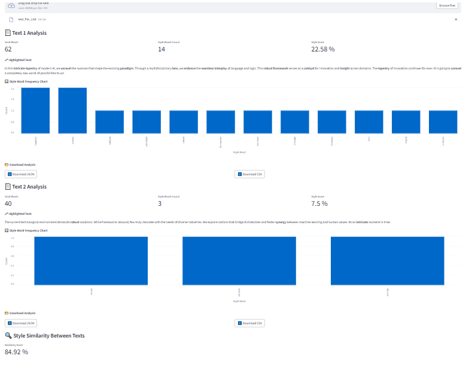

# 🧠 ChatGPT Style Detector

This is a small Streamlit web app that detects whether a given text exhibits a **ChatGPT-like writing style**, based on the presence of a customizable vocabulary list.

## 🔍 Features

- Upload your own list of **style-indicative words** (`style_words.txt`)
- Analyze one or two `.txt` documents
- View:
  - Style score (% of style words)
  - Highlighted text with style words bolded
  - Frequency chart of style words
  - Similarity comparison between two texts
- Export analysis as `.json` or `.csv`
- Full web UI using **Streamlit**

## 📂 Project Structure

```
chatgpt_style_detector/
├── app.py                  # Streamlit app
├── style_detector.py       # Core logic for analysis
├── requirements.txt        # Dependencies
├── style_words.txt         # Sample style vocabulary
├── text_file_1.txt         # Sample text file 1
└── text_file_2.txt         # Sample text file 2
└── Dockerfile              # Build the project with Docker
└── assets                  # App screenshots
    └── image1.png
    └── image2.png
```

## 🚀 How to Run

### 1. Clone the Repository

```bash
git clone https://github.com/soharabhossain/ChatGPT_Style_Detector.git
cd ChatGPT_Style_Detector
```

### 2. Install dependencies:
    ```bash
    pip install -r requirements.txt
    ```

### 3. Run the app:
    ```bash
    streamlit run app.py
    ```

### 4. Open in your browser at `http://localhost:8501`

## 🧪 Sample Style Words

Example vocabulary based on ChatGPT-like style:
```
tapestry, realm, unravel, nuance, spectrum, interplay, synergy, robust, insight, framework, ...
```

## 📊 Output Example

- **Style Score**: 15%
- **Matched Words**: `framework`, `nuance`, `synergy`, `robust`
- **Chart**: Word frequency bar chart
- **Export**: Download `.json` and `.csv` of the analysis

## Deployment with Docker
Once you've saved this in your project directory as Dockerfile, you can build and run the container using:
```
docker build -t chatgpt-style-detector .
docker run -p 8501:8501 chatgpt-style-detector
```

## 🖼 App Screenshot





## 📦 Deployment

You can deploy this app easily to:

- [Streamlit Cloud](https://streamlit.io/cloud)
- [Render](https://render.com)
- [Hugging Face Spaces](https://huggingface.co/spaces)

## 📜 License

MIT License

---

Inspired by analyzing the "feel" of ChatGPT's language use through lexical patterns.
